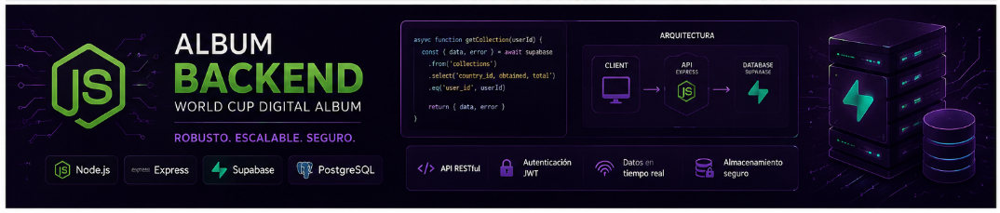
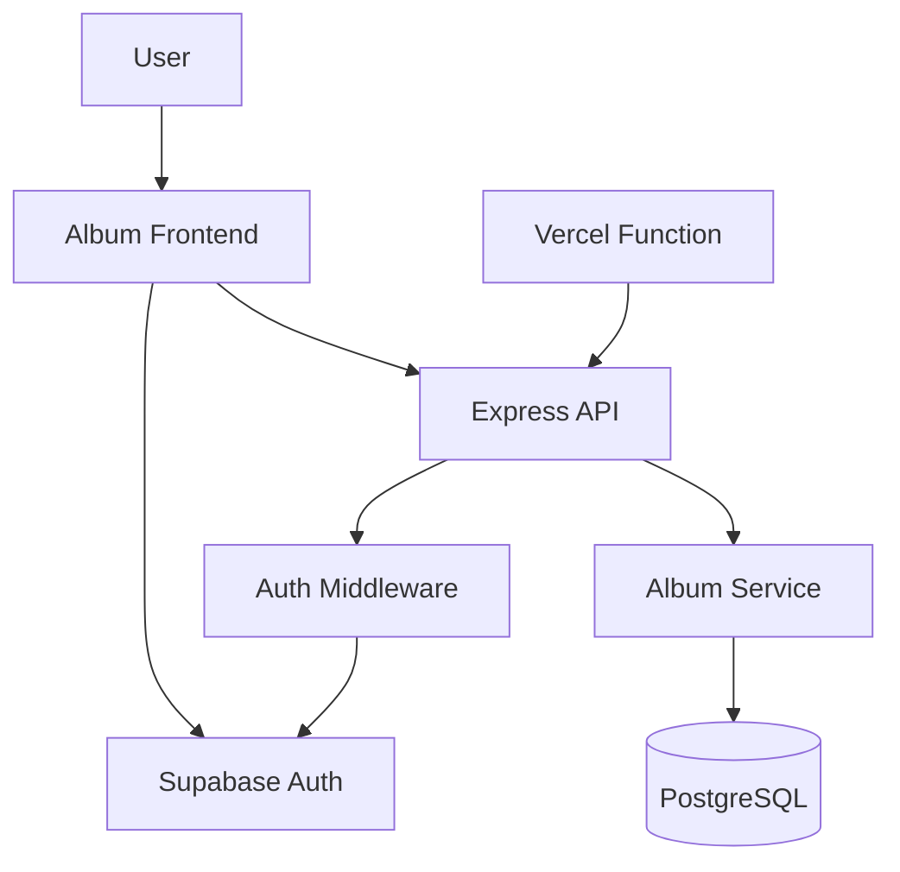

<p align="center">
  
</p>

<div align="center">

# Album Backend

Secure Express API for authenticated World Cup digital album progress.

</div>

<p align="center">
  
  
  
  
  
</p>

<div align="center">

**Nicolas AI Engineering Lab**<br>
Software Architecture - Cloud Engineering - Practical Product Systems

</div>

## Overview

Album Backend is the persistence layer for a digital World Cup sticker album. The frontend owns the catalog and login experience; this API validates Supabase user sessions and stores each authenticated user's album progress in PostgreSQL.

<table>
<tr>
<td width="50%">

### What it solves

Keeps album progress tied to a real authenticated user instead of local browser state or anonymous codes.

</td>
<td width="50%">

### Why it matters

Users can safely return to their collection from different sessions while the backend keeps ownership and data boundaries clear.

</td>
</tr>
<tr>
<td width="50%">

### Deployment target

Prepared for Vercel through a serverless Express entrypoint in `api/index.js`.

</td>
<td width="50%">

### Data model

One album per Supabase user, with sticker quantities stored only when greater than zero.

</td>
</tr>
</table>

## Before vs After

| Before | After |
|---|---|
| Local backend folder without Git history | GitHub repository with `main` pushed |
| Generic README | Portfolio-grade technical landing page |
| Express app tied directly to `app.listen` | Split app/server entrypoints for local and Vercel runtime |
| Heavy unused image export inside backend | Lean backend repository with visual docs assets only |
| Deployment steps spread across context | Dedicated deployment checklist and API docs |

## Architecture



| Component | Responsibility |
|---|---|
| `api/index.js` | Serverless entrypoint for Vercel. |
| `src/app.js` | Express app, routes, CORS, JSON parsing, and error handling. |
| `src/server.js` | Local and Docker listener. |
| `src/middleware/authMiddleware.js` | Validates Supabase bearer tokens. |
| `src/services/albumService.js` | Album creation, progress reads, sticker updates, and batch persistence. |
| `database/init.sql` | PostgreSQL schema and triggers for album progress. |

## Tech Stack

<p align="center">
  
</p>

| Layer | Technology |
|---|---|
| Runtime | Node.js 20+ |
| API | Express |
| Auth | Supabase Auth |
| Database | PostgreSQL |
| Local stack | Docker Compose |
| Deployment | Vercel serverless functions |

## Quick Start

```bash
npm install
cp .env.example .env
npm run dev
```

Health check:

```bash
curl http://localhost:3000/api/health
```

Expected response:

```json
{ "status": "ok" }
```

## Environment Variables

| Variable | Required | Description |
|---|---:|---|
| `PORT` | No | Local HTTP port. Defaults to `3000`. |
| `HOST` | No | Local bind host. Defaults to `0.0.0.0`. |
| `CORS_ORIGINS` | Yes in production | Comma-separated frontend origins allowed by CORS. |
| `SUPABASE_URL` | Yes | Supabase project URL. |
| `SUPABASE_ANON_KEY` | Yes | Public anon key used to validate user sessions. |
| `DATABASE_URL` | Production | PostgreSQL connection string. Takes precedence over split DB vars. |
| `DB_SSL` | Production | Use `true` for hosted PostgreSQL providers that require TLS. |
| `DB_HOST` / `DB_PORT` / `DB_USER` / `DB_PASSWORD` / `DB_NAME` | Local/Docker | Split PostgreSQL connection settings. |

> Never commit `.env`. If a secret was exposed, rotate it before deploying. This API does not need `SUPABASE_SERVICE_ROLE_KEY`.

## API Surface

| Method | Route | Auth | Purpose |
|---|---|---:|---|
| `GET` | `/api/health` | No | Service health check. |
| `POST` | `/api/me/album` | Yes | Create or return current user's album. |
| `GET` | `/api/me/album` | Yes | Get album metadata. |
| `GET` | `/api/me/album/progress` | Yes | Get full sticker progress. |
| `GET` | `/api/me/album/progress/team/:teamCode` | Yes | Get progress for one team. |
| `PUT` | `/api/me/album/stickers` | Yes | Batch update sticker quantities. |
| `PUT` | `/api/me/album/stickers/:stickerCode` | Yes | Replace one sticker quantity. |
| `POST` | `/api/me/album/stickers/:stickerCode/increment` | Yes | Increment one sticker. |
| `POST` | `/api/me/album/stickers/:stickerCode/decrement` | Yes | Decrement one sticker. |

Full endpoint examples live in [`docs/API.md`](docs/API.md).

## Deploy to Vercel

This repository includes the deployment pieces Vercel needs:

<table>
<tr>
<td width="33%">

### Serverless entry

`api/index.js` exports the Express app for Vercel.

</td>
<td width="33%">

### Routing

`vercel.json` rewrites incoming requests to the API function.

</td>
<td width="33%">

### Build check

`npm run vercel-build` runs syntax verification before deploy.

</td>
</tr>
</table>

Deployment checklist:

1. Import `NicolasHoyosDevss/Album-backend` in Vercel.
2. Set the environment variables from `.env.example`.
3. Use a hosted PostgreSQL database.
4. Run `database/init.sql` once against that database.
5. Add the deployed frontend URL to `CORS_ORIGINS`: `https://album-front-two.vercel.app`.
6. Verify `GET /api/health` after deployment.

Detailed checklist: [`docs/DEPLOYMENT.md`](docs/DEPLOYMENT.md).

## Local Docker Stack

```bash
docker compose up --build
```

| Service | URL |
|---|---|
| Backend | `http://localhost:3000` |
| Health check | `http://localhost:3000/api/health` |
| PostgreSQL | `localhost:5432` |

The compose file also expects the frontend at `../Album-frontend`.

## Project Structure

```txt
Album-backend/
|-- api/
|   `-- index.js
|-- database/
|   `-- init.sql
|-- docs/
|   |-- API.md
|   |-- DEPLOYMENT.md
|   `-- assets/
|       |-- album-back.png
|       `-- album-footer.png
|-- scripts/
|   `-- check-syntax.js
|-- src/
|   |-- app.js
|   |-- server.js
|   |-- config/
|   |-- controllers/
|   |-- middleware/
|   |-- routes/
|   `-- services/
|-- Dockerfile
|-- docker-compose.yml
|-- package.json
|-- vercel.json
`-- README.md
```

## Verification

```bash
npm test
```

Current verification checks JavaScript syntax for the server, Vercel entrypoint, and scripts. Add integration tests before changing database behavior; correctness needs evidence, not optimism.

## Roadmap

| Stage | Status | Focus |
|---|---|---|
| Backend persistence | Done | Authenticated album progress with PostgreSQL. |
| Vercel readiness | Done | Serverless entrypoint, rewrites, and deploy docs. |
| API documentation | Done | Endpoint reference and environment setup. |
| Integration tests | Planned | Database-backed route verification. |
| Observability | Planned | Structured logs and production health signals. |

## Engineering Notes

- Keep the frontend responsible for the sticker catalog.
- Keep the backend responsible for identity, ownership, and persistence.
- Store only positive sticker quantities to keep progress data compact.
- Use the Supabase anon key for user-token validation; do not use service-role credentials in this flow.

<p align="center">
  
</p>

## Author

Built by **Nicolas Hoyos**<br>
Software Engineering - AI Engineering - Software Architecture<br>

> Building intelligent systems, scalable architectures, and practical AI products.